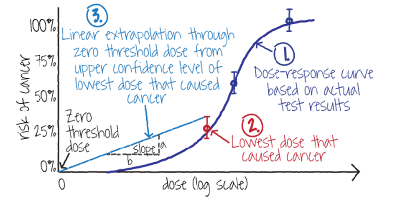
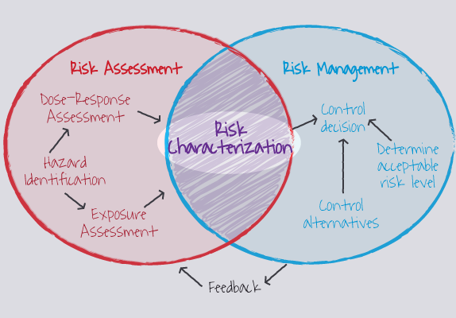

## Steps of Environmental health risk assessment

## What is hazard identification?
- What health effects will results if humans were exposed to a hazard
- Start with conducting a review of the basic principles
- Review toxicology literature
- Review epidemiology literature
- Animal studies

## What will you study?
- Quality of the review
- The specific mix of exposure chemicals or agents
- Health outcome (there can be more than one health outcomes)
- If you study animal models, how can the exposure to animal be extrapolated to humans?
- What are the possible routes?

## Quick check:
What happens during the hazard identification step?
[Answer here](https://www.wooclap.com/EHRA)

## Step 2: Exposure assessment: Assumption

**No Exposure = No risk**

## Possible routes of exposure

## What are routes of exposure?
[Answer here](https://www.wooclap.com/EHRA)

## Three steps of exposure assessment
1. Characterise the point of exposure and the scenario
2. Identify exposure pathways
3. Quantify the exposure

## Exposure assessment: what do we do?
- In this step you measure or assess how much people are exposed to the toxin
- Use surveys, biomonitoring, statistical modelling
- Surveys are cross-sectional surveys to identify how much of a chemical is present
- Blood or body fluids are taken from people to measure how much of a chemical they are exposed to
- You will need to know the pathways of exposure

## Step 2: Exposure assessment through computer modelling
- You can set up computer models to understand how much people were exposed
- Used in air quality monitoring
- You will need to understand how toxins are produced and how they are dispersed

## Step 3: Dose response assessment
- Assess what happens to the health effect if the dose also increases
- Difference between dose and exposure
[Answer here](https://www.wooclap.com/EHRA)

## What do we do for dose-response assessment?
- First, decide if the toxin we are exposed to can cause cancer
- Study epidemiological studies or animal experimental studies
- IF it can cause cancer, THEN use a slope factor to assess the dose response curve
- IF it can cause cancer, then there cannot be a theoretical low value because 
- we do not know how much of a toxin is sufficient to cause cancer
- Hence we use a 'slope factor'

## Dose response assessment: slope factor

## If the toxin does not result in cancer
- We identify a THRESHOLD level
- Below the THRESHOLD level of the dose, there will be no health effect
- If there is NO HARM, then that threshold level is termed NOAEL
- NOAEL: No observed adverse effect level
- If the disease is not binary (say something like depression, or heart rhythm change)
- LOAEL: Lowest observed adverse effect level

## Concept of NOAEL and LOAEL

## Check some concepts
[Answer this](https://www.wooclap.com/EHRA)

## Step 4: Risk Characterisation

## for cancer causing toxins
- Multiply daily intake or daily exposure (mg/Kg/day) with Slope factor
- Express lifetime risk of probability of developing cancer over lifetime (70 years)
- Example: risk of cancer is 1 in 1, 000, 000 of developing cancer over lifetime

## for non-cancer toxins
- Compare the current exposure levels with Rfd

## Conclusions
- The main principles of EHRA: 
- Hazard identification, exposure assessment, dose-response asssessment, risk characterisation
- These vary depend on whether the toxin can cause cancer or not
- We will run through an exercise next week

## Challenge

You are a public health officer in the district. In a rural town T, a new factory has started producing processed food. Some residents are concerned that the factory discharges a chemical E that can harm their livestock and affect their health. The district councillor has asked your office to investigate the claim. What is the FIRST thing you will do?
[Answer this in](https://www.wooclap.com/EHRA)

